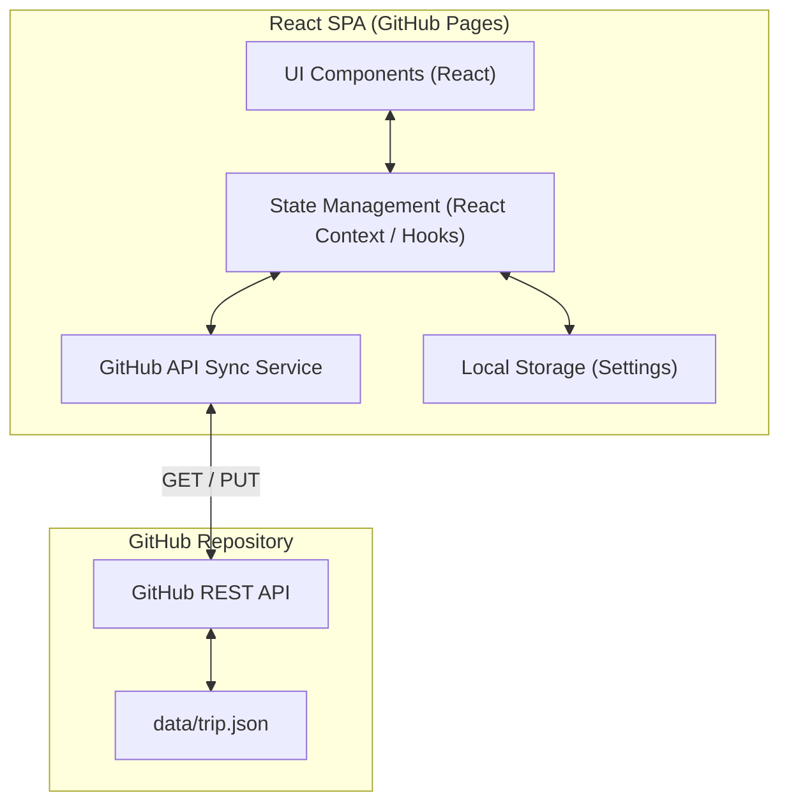
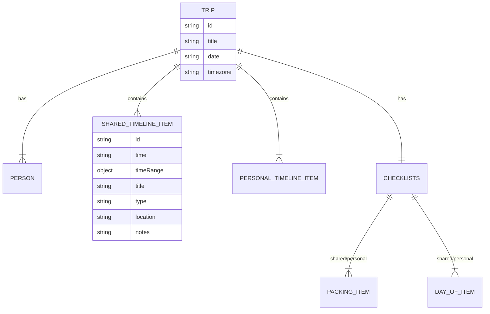

## 1. Architecture Design



## 2. Technology Description
- **Frontend Framework**: React 18 with TypeScript.
- **Build Tool**: Vite (configured with correct `base` for GitHub Pages).
- **Styling**: Tailwind CSS for rapid, mobile-first responsive design.
- **Icons**: Lucide React for consistent UI iconography.
- **Data Fetching**: Native `fetch` API wrapping GitHub REST endpoints.
- **Routing**: Client-side state-based rendering (since it's a simple multi-tab app, React Router can be used or a simple state-based tab switcher).

## 3. Route Definitions / View States
As a lightweight mobile web app, navigation will be handled via state-based tabs rather than complex URL routing to keep the GitHub Pages deployment simple without needing a 404 fallback hack.

| View State | Purpose |
|------------|---------|
| `dashboard` | "Next step" overview based on current time and POV. |
| `timeline` | Full trip itinerary with collapsible groups and edit mode. |
| `checklists`| Shared and personal packing and day-of checklists. |
| `settings` | GitHub configuration and PAT management. |

## 4. API Definitions (GitHub REST API)

The app interacts exclusively with the GitHub REST API for file content manipulation.

### Fetch File Content
- **Endpoint**: `GET https://api.github.com/repos/{owner}/{repo}/contents/{path}?ref={branch}`
- **Headers**: `Authorization: Bearer {PAT}`, `Accept: application/vnd.github.v3+json`
- **Response**: Contains `content` (base64 encoded) and `sha`.

### Update File Content
- **Endpoint**: `PUT https://api.github.com/repos/{owner}/{repo}/contents/{path}`
- **Headers**: `Authorization: Bearer {PAT}`, `Accept: application/vnd.github.v3+json`
- **Body**:
  ```json
  {
    "message": "Update trip plan via Trip Hub",
    "content": "[Base64 encoded new JSON string]",
    "sha": "[SHA from previous GET request]",
    "branch": "{branch}"
  }
  ```

## 5. Server Architecture Diagram
*Not applicable. This is a Serverless Frontend communicating directly with the GitHub API.*

## 6. Data Model

The application uses a strict JSON schema for the trip data.

### 6.1 Data Model Definition



### 6.2 Data Definition (JSON Schema Reference)
The core source of truth is `data/trip.json` containing:
- `schemaVersion`
- `trip`: metadata, `people` array (Wisli, Gab).
- `personalTimelines`: dictionary of personal events by person ID.
- `sharedTimeline`: array of common events.
- `checklists`: categorized into `shared` and `personal`.
