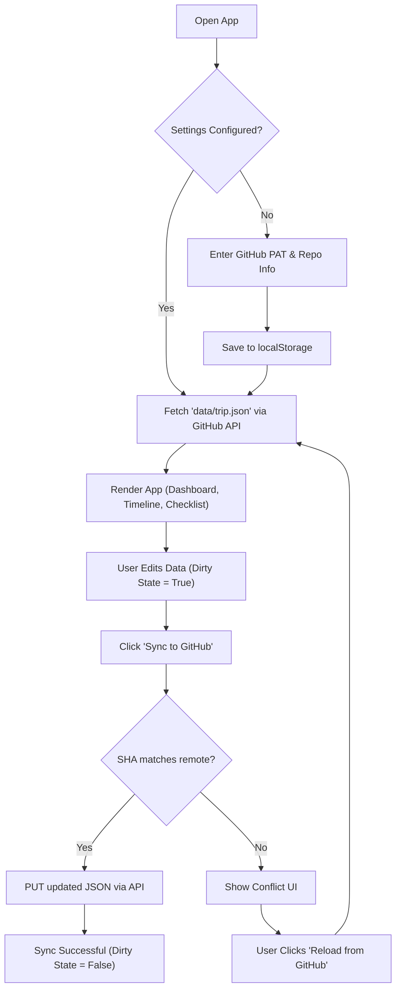

## 1. Product Overview
A mobile-first "Trip Hub" web application designed for two users to collaboratively view, edit, and sync a shared trip plan (timeline and checklists). The app is hosted on GitHub Pages and syncs data directly back to the GitHub repository using the GitHub REST API without a traditional backend.

## 2. Core Features

### 2.1 User Roles
| Role | Registration Method | Core Permissions |
|------|---------------------|------------------|
| App User | Personal Access Token (PAT) | View trip plan, edit timeline and checklists, sync changes to GitHub repository |

### 2.2 Feature Modules
1. **Header & Status**: POV switcher (Shared / Wisli / Gab), sync status indicator (last loaded, last synced, dirty state).
2. **Dashboard**: Dynamic "Next step" computation based on current time and selected POV.
3. **Timeline View**: Collapsible sections (e.g., Morning, Transfer, Alishan, Return) with add/edit/reorder capabilities.
4. **Checklist View**: Interactive packing and day-of checklists, synced globally.
5. **Settings Page**: Configuration for GitHub sync (owner, repo, branch, file path, and PAT).

### 2.3 Page Details
| Page Name | Module Name | Feature description |
|-----------|-------------|---------------------|
| Main App | Header | Switch between Shared, Wisli, or Gab POV; displays dirty state and last sync time. |
| Main App | Dashboard Tab | Computes and displays the immediate next step based on the current time and POV. |
| Main App | Timeline Tab | Displays timeline entries in collapsible groups. Users can edit text/time, add, remove, and reorder items. |
| Main App | Checklist Tab | Displays shared and personal packing/day-of checklists with toggleable checkboxes. |
| Settings | Configuration | Form to input and save GitHub owner, repo, branch, file path, and fine-grained PAT to `localStorage`. |
| Sync UI | Sync Button | Action to pull/push JSON data via GitHub REST API, with conflict resolution (SHA mismatch handling). |

## 3. Core Process
The primary user flow involves loading the trip data, making local edits, and syncing back to the repository.

## 4. User Interface Design

### 4.1 Design Style
- **Color Theme**: Nature-inspired palette suitable for a mountain trip (forest greens, soft wood tones, clean white backgrounds) with a modern, clean aesthetic.
- **Typography**: Clean sans-serif (e.g., Inter or system fonts) with clear hierarchy for timeline times and descriptions.
- **Components**: Card-based layout for timeline items, rounded corners, subtle shadows for depth.
- **Interactions**: Smooth transitions for collapsible sections, distinct visual feedback for unsynced changes (e.g., a yellow indicator turning green upon sync).

### 4.2 Page Design Overview
| Page Name | Module Name | UI Elements |
|-----------|-------------|-------------|
| Main Layout | Navigation | Bottom or top tab bar for easy thumb reach on mobile (Dashboard, Timeline, Checklists, Settings). |
| Timeline | List Items | Left-aligned times, right-aligned content. Edit icon to toggle edit mode. |
| Sync Status | Indicator Bar | Small top bar or header icon indicating "Unsaved changes" or "Synced just now". |

### 4.3 Responsiveness
- **Mobile-first**: The interface is primarily designed for mobile screens, ensuring large touch targets for buttons and checkboxes.
- **Desktop Adaptive**: Expands gracefully on larger screens, possibly showing timeline and checklists side-by-side.
